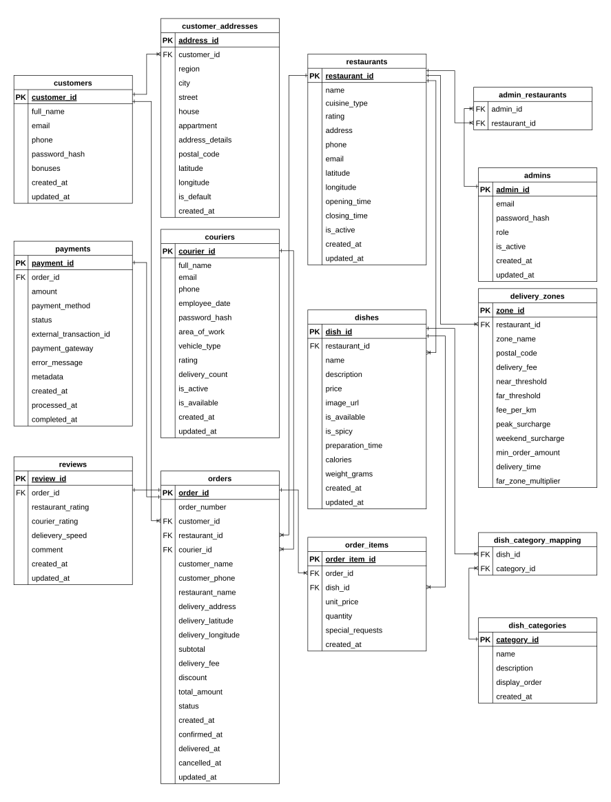
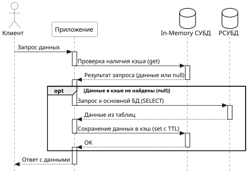
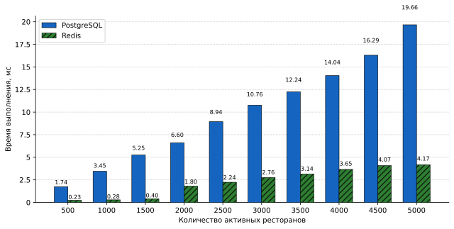
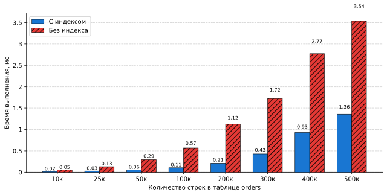

# Food Delivery API

## Курсовая работа по дисциплине «Базы данных»

REST API системы онлайн-заказа еды — агрегатор, связывающий клиентов, рестораны и курьеров в единой платформе.

---

## Стек технологий

| Слой | Технологии |
|---|---|
| **Backend** | Java 21, Spring Boot 4, Spring Security, Spring Data JPA |
| **База данных** | PostgreSQL 15, Flyway (миграции) |
| **Кэширование** | Redis 7 |
| **Аутентификация** | JWT (jjwt 0.12.6, алгоритм HS512) |
| **Документация API** | SpringDoc OpenAPI / Swagger UI |
| **Сборка** | Gradle (Kotlin DSL) |
| **Инфраструктура** | Docker Compose |
| **Исследования** | Python 3, psycopg2, matplotlib, Faker |

---

## Структура репозитория

```
DB-CW/
├── food-delivery-api/      # Spring Boot бэкенд
│   ├── src/main/java/
│   │   └── com/example/deliveryservice/
│   │       ├── config/         # Конфигурации (Redis, Security)
│   │       ├── controllers/    # REST-контроллеры (impl/)
│   │       ├── dto/            # DTO: команды (command/) и ответы (response/)
│   │       ├── entity/         # JPA-сущности
│   │       ├── exceptions/     # Глобальная обработка ошибок
│   │       ├── repository/     # Spring Data репозитории
│   │       ├── security/       # JWT-фильтр, UserDetailsService
│   │       └── services/       # Бизнес-логика
│   ├── src/main/resources/
│   │   ├── application.properties
│   │   └── db/migrations/      # Flyway V1–V8
│   └── docker-compose.yml      # PostgreSQL:5433 + Redis:6379
├── research/               # Скрипты для исследовательского раздела
│   ├── seed_data.py            # Утилиты генерации данных
│   ├── benchmark_indexes.py    # Бенчмарк составного индекса
│   ├── benchmark_cache.py      # Бенчмарк Redis vs PostgreSQL
│   ├── docker-compose.test.yml # Изолированные контейнеры (postgres:5434, redis:6380)
│   └── requirements.txt
├── scripts/
│   └── data_generator.py       # Генератор тестовых данных
├── data/                   # Результаты бенчмарков (CSV, PDF)
├── docs/                   # LaTeX-документация (РПЗ)
└── presentation/           # Презентация
```

---

## Быстрый старт

### Предварительные требования

- Java 21+
- Docker & Docker Compose
- Python 3.11+ *(только для исследовательских скриптов)*

### 1. Запуск инфраструктуры

```bash
cd food-delivery-api
docker compose up -d
```

Поднимает PostgreSQL на порту **5433** и Redis на порту **6379**.

### 2. Запуск приложения

```bash
cd food-delivery-api
./gradlew bootRun
```

При первом запуске Flyway автоматически применит все миграции (V1–V8) и создаст схему БД.

### 3. Swagger UI

После запуска откройте в браузере:

```
http://localhost:8080/swagger-ui.html
```

---

## API — основные эндпоинты

| Группа | Префикс | Публичный доступ |
|---|---|---|
| Аутентификация | `/api/v1/auth/**` | ✅ |
| Рестораны | `/api/v1/restaurants` | ✅ (чтение) |
| Блюда | `/api/v1/dishes` | ✅ (просмотр доступных) |
| Зоны доставки | `/api/v1/delivery-zones` | ✅ (чтение) |
| Клиенты | `/api/v1/customers` | 🔐 `ROLE_CUSTOMER` |
| Адреса | `/api/v1/addresses` | 🔐 `ROLE_CUSTOMER` |
| Заказы | `/api/v1/orders` | 🔐 Клиент / Курьер |
| Платежи | `/api/v1/payments` | 🔐 Клиент |
| Отзывы | `/api/v1/reviews` | 🔐 Клиент |
| Курьеры | `/api/v1/couriers` | 🔐 `ROLE_COURIER` |
| Администрирование | `/api/v1/admin` | 🔐 `ROLE_SYSTEM_ADMIN` |

> Полная спецификация доступна через Swagger UI после запуска приложения.

---

## Архитектура

### Схема базы данных

14 таблиц, управляемых через Flyway-миграции:


**Ключевые особенности схемы:**
- `orders` денормализован: хранит снапшоты `customer_name` и `restaurant_name`
- Триггеры `trg_update_restaurant_rating` и `trg_update_courier_rating` автоматически пересчитывают рейтинги при появлении нового отзыва
- Функция `calculate_order_total()` вычисляет стоимость заказа с учётом зоны доставки, пиковых надбавок и скидки первого заказа

### Миграции (Flyway)

| Версия | Содержание |
|---|---|
| V1 | Создание enum-типов (статусы, роли, типы) |
| V2 | Создание таблиц |
| V3 | Добавление ограничений целостности |
| V4 | Создание индексов |
| V5 | Функция `calculate_order_total()` |
| V6 | Триггеры для рейтингов |
| V7 | Роли PostgreSQL |
| V8 | Фикс функции расчёта стоимости при отсутствии зоны |

### Безопасность

- **Аутентификация:** stateless JWT (HS512). `UserDetailsServiceImpl` ищет пользователя последовательно в таблицах `customers → couriers → admins`
- **Авторизация:**
  - `AdminController` — через `@PreAuthorize`
  - Остальные контроллеры — ручная проверка владельца ресурса с выбросом `AccessDeniedException`

### Кэширование (Redis)


| Кэш | TTL |
|---|---|
| `restaurants` | 60 мин |
| `dishes` | 30 мин |
| `deliveryZones` | 120 мин |
| `couriers` | 15 мин |
| *прочие* | 30 мин |

`@CacheEvict(allEntries = true)` вызывается на всех мутирующих методах сервиса.

---

## Сборка и тестирование

```bash
cd food-delivery-api

# Сборка
./gradlew build

# Чистая сборка
./gradlew clean build

# Все тесты
./gradlew test

# Конкретный тест-класс
./gradlew test --tests "com.example.deliveryservice.<ClassName>"
```

---

## Исследовательский раздел

Два независимых бенчмарка, работающих с **изолированными** тестовыми контейнерами (не пересекаются с рабочей БД).

### Подготовка

```bash
cd research

# Изолированная инфраструктура (postgres:5434, redis:6380)
docker compose -f docker-compose.test.yml up -d

pip install -r requirements.txt
```

### Запуск бенчмарков

```bash
# Исследование влияния составного индекса на таблице orders
python benchmark_indexes.py   # ~15–30 мин

# Исследование Redis vs PostgreSQL (запрос списка активных ресторанов)
python benchmark_cache.py     # ~5 мин
```

Результаты сохраняются в `../data/` в форматах CSV и PDF.

### Результаты

**Кэширование (Redis vs PostgreSQL)**

При выборке 5 000 записей Redis выполняет запрос за **4.2 мс** против **19.7 мс** у PostgreSQL.  
Время PostgreSQL растёт в **3.8 раза быстрее** по мере увеличения объёма данных (R² ≈ 0.991).

**Составной индекс `idx_orders_customer_status` на `(customer_id, status)`**


| Строк | С индексом | Без индекса | Ускорение |
|---:|---:|---:|---:|
| 10 000 | 0.018 мс | 0.052 мс | 2.9× |
| 100 000 | 0.106 мс | 0.569 мс | 5.4× |
| 500 000 | 1.357 мс | 3.535 мс | 2.6× |

---

## Документация

Полная расчётно-пояснительная записка (РПЗ) находится в директории `docs/`:

- `ИУ7-63Б-Павлов-Даниил-КуР-БД-РПЗ.pdf` — итоговый PDF
- Исходники LaTeX: `00-introduction.tex` … `05-conclusion.tex`, `appendix-*.tex`

---
